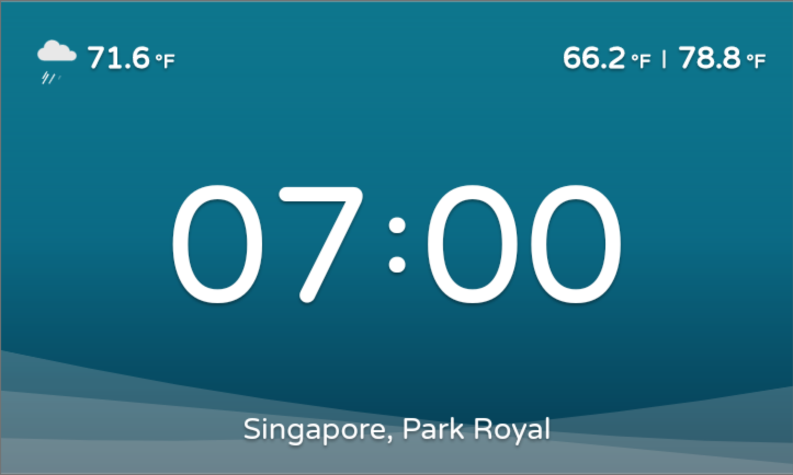
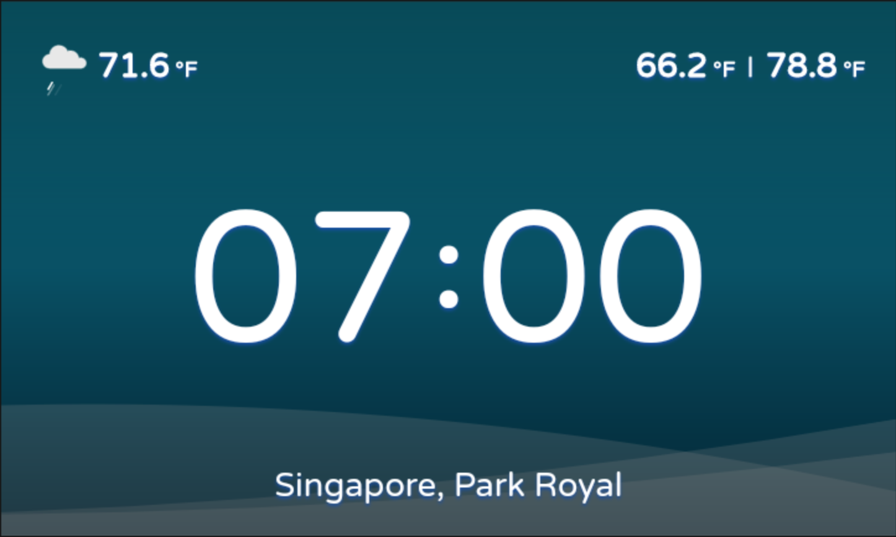
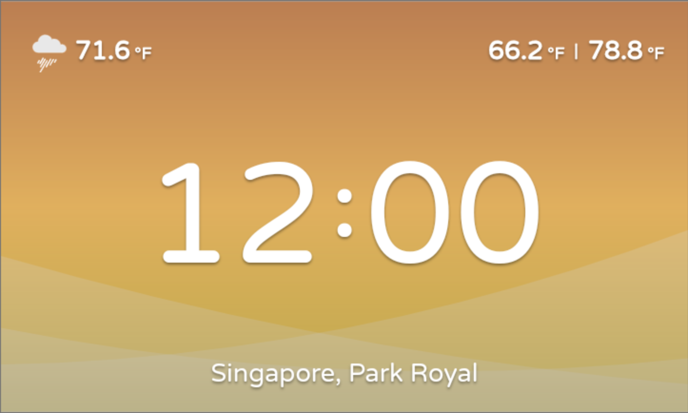
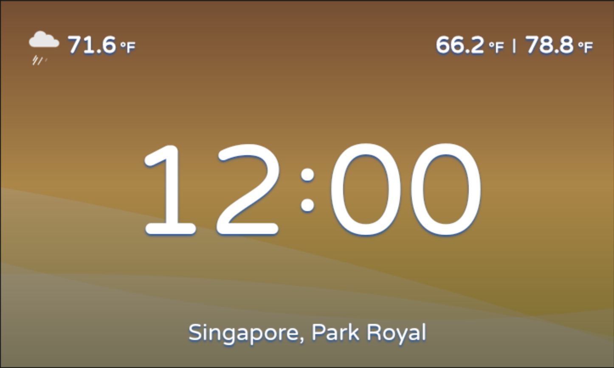
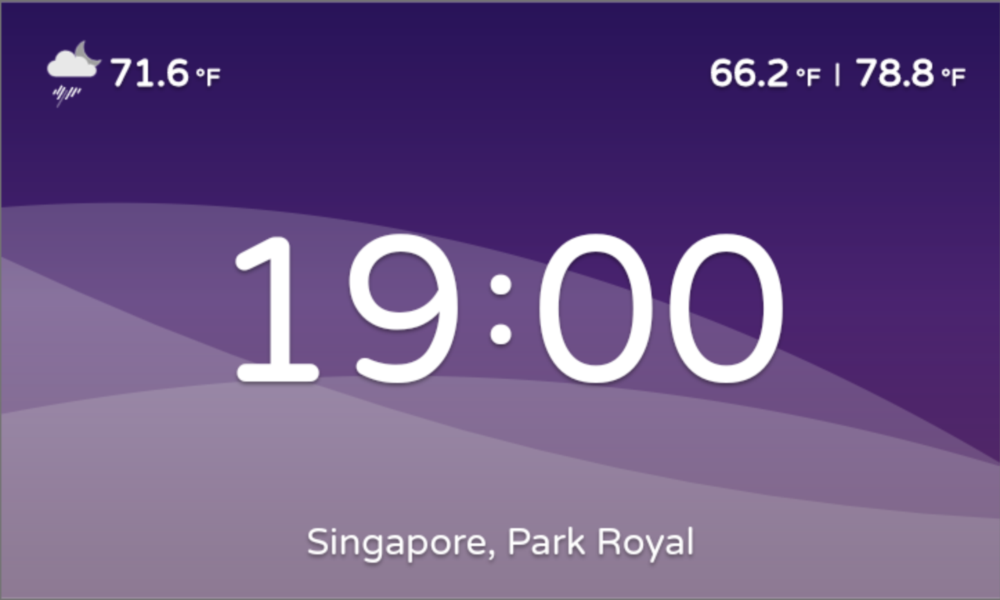
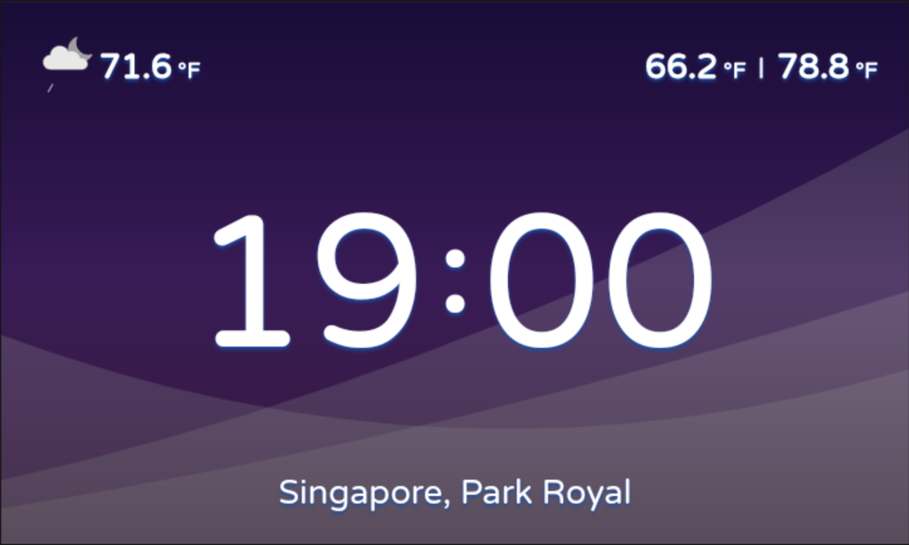
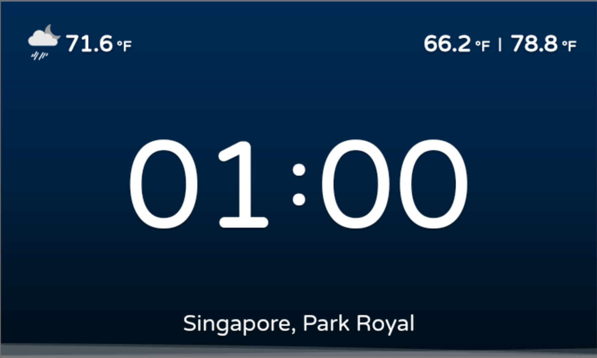
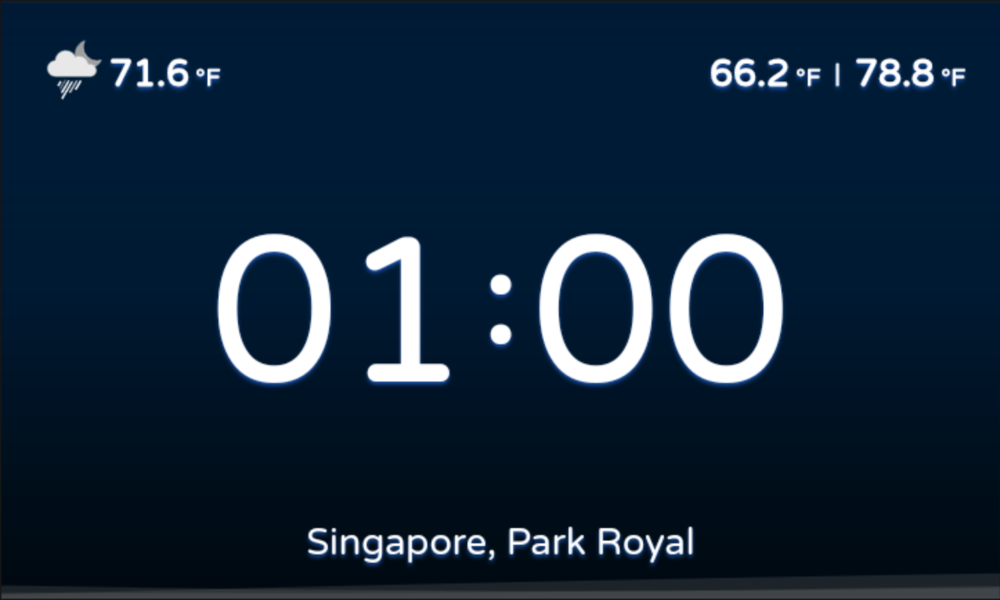
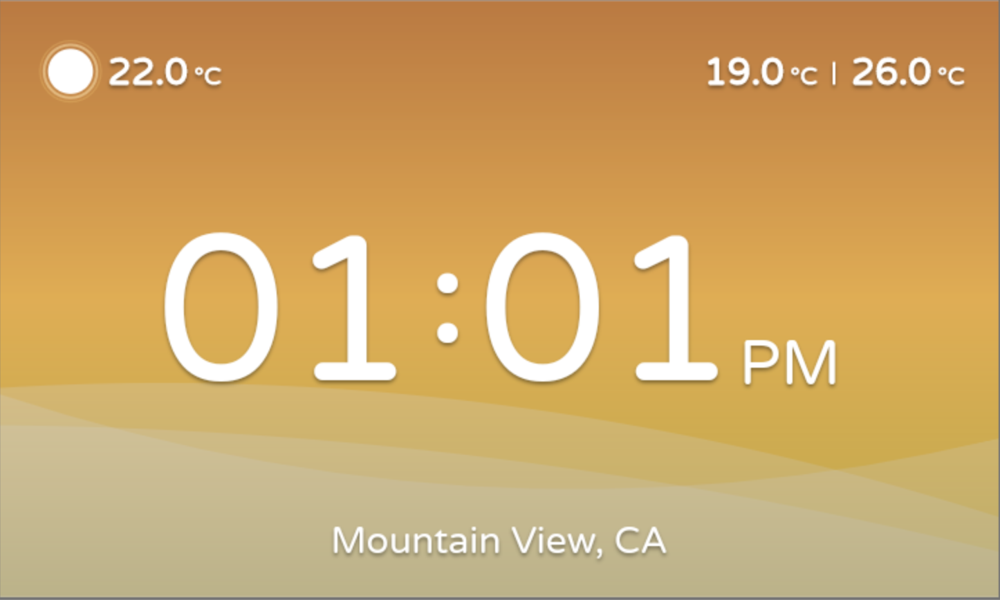
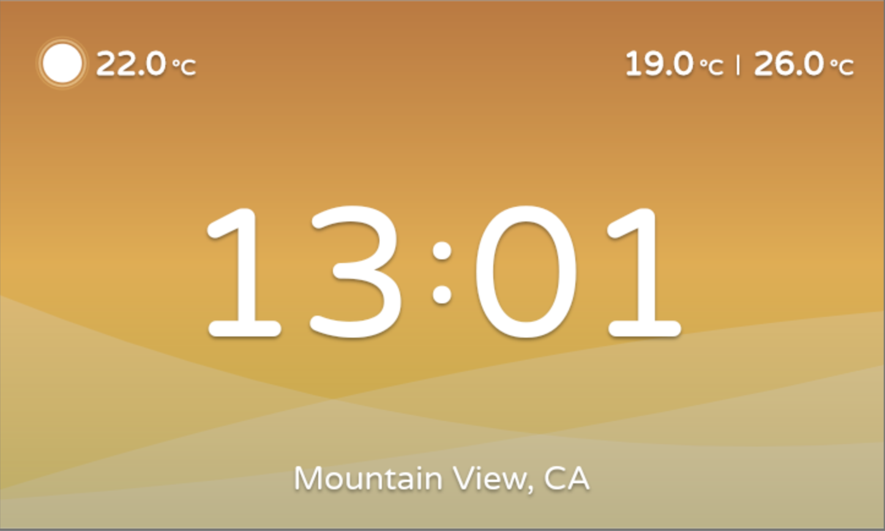

# Digital Clock

This app is an example of a digital clock.
It has a light theme and a dark theme.
See the [Analog Clock](../analog_clock) if you'd like an example that displays the weather and location.

## Example

### **Color & Wave Changes**

The color gradient change with respect to the current hour.

The wave height change with respect to the current hour.

|Time Period|Light|Dark|Wave Height|
|:--|:-:|:-:|:--|
|Morning|||Approx. 0.3 of screen height|
|Afteroon|||Approx. 0.5 of screen height|
|Evening|||Approx. 0.79 of screen height|
|Midnight|||Approx. 0.04 of screen height|

### Time format

|Format|Example|
|:--|:-:|
|12 Hours||
|24 Hours||

### **Weather Icon**

Icons are from [Joseph Cheng - Weather Flat Icons](https://rive.app/a/josephcheng/files/flare/weather-flat-icons/preview) which is a edited version and forked from [AmirHossein SamadiPour - Weather Flat Icons](https://rive.app/a/SamadiPour/files/flare/weather-flat-icons/preview). Under [License (CC BY 4.0)](https://creativecommons.org/licenses/by/4.0/)

